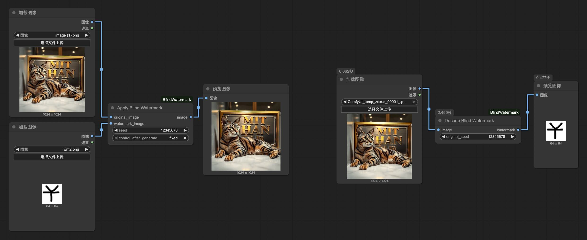
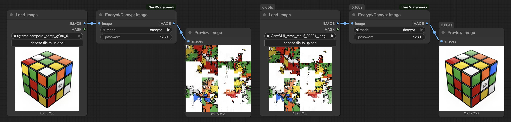

# ComfyUI-BlindWatermark
Embeds an invisible watermark in the input image

## Preview
  
  

## Usage
- strength: **larger = more robust** (but also more artifacts)  
- block_size: **larger = more invisible** (but image may not have enough space)  
- robustness: **larger = more robust** (but image may not have enough space)  

## Credits
- [BlindWatermark](https://github.com/fire-keeper/BlindWatermark) @darksouls4  
